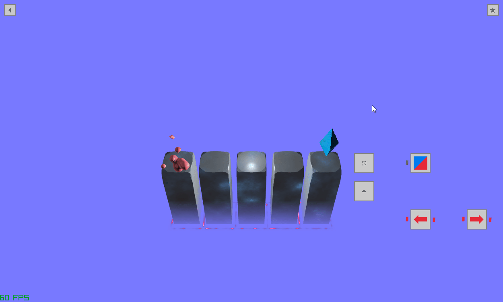

# Perspectron

insert gif of game

## Idea
You have limited movements to reach the goal. To do so you will have to change your perspective:
Instead of moving the player, move the goal. Instead of moving the goal, move the block it rests on. Instead of going to the right, turn the playing field clockwise and move down. From these simple rules a lot of interesting, levels can be designed, which challenge the players intuitions and

## Future Graphics
The prototype of the game is not really aethetically interesting, so I am in the process of polishing the graphics. 
Sadly the transfer to the more compelling system is not done yet, but here is an outlook to the future visuals of the game.

insert gif

## Mechanics
Turn the playing fields and collect additional resources

Have more then one player, so that you have to coordinate their movement.

Move blocks to form path/move players/move goals

Your movement resources are tied to a color -> Change the color of your player and tile, so that you can bridge the gap by moving the tiles.

### Future Mechanics
Turn the playing field to from a 3 dimensions to 2, so that height differences disappear and you move over block
(You can also generate the effect of Esher paintings this way)

## Sequences
Levels are organized into sequences/chapters, which riff off the same concept. I want to explore the "idea-space" of a mechanic in this way.
Examples of this are:
- Have the same layout, but vastly different solutions, caused by small differences
- Have different layouts but similar solutions
- etc.

This sequence explores the ways of transporting the player across a gap, by arranging the black blocks in the right sequence.

insert discription of the different levels and how they comment on each other

## Game Engine
Since the game is limited in scope and graphics, I wrote the game engine for this project myself. Features of it are:
- automatic playback of solutions
- a custom level editor, which makes it easy to construct new levels
- etc.
